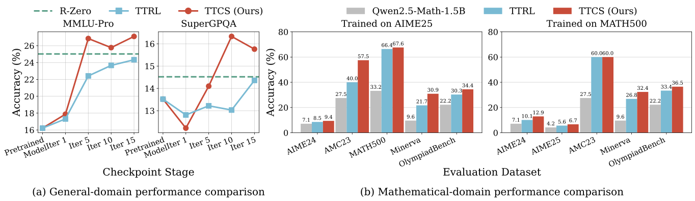

# TTCS: Test-Time Curriculum Synthesis for Self-Evolving

<div align="center">
    <a href="https://arxiv.org/abs/2601.22628"></a>
    <a href="https://huggingface.co/papers/2601.22628"></a>
    <a href="https://github.com/XMUDeepLIT/TTCS"></a>
    <a href="https://github.com/XMUDeepLIT/TTCS/blob/main/LICENSE"></a>
</div>

<br>

> A self-evolving framework that enhances LLM mathematical reasoning through dynamic Synthesizer-Solver co-evolution at test time.

## 🏴 Overview

<p align="center">
  
</p>

**TTCS (Test-Time Curriculum Synthesis)** is a co-evolving test-time training framework built on an iterative GRPO optimization loop. It consists of two agents: a **Synthesizer** policy $\pi_{\phi}$ and a **Solver** policy $\pi_{\theta}$, both initialized from the same pretrained model.

At each iteration:
- The **Synthesizer** generates curriculum variants for each test question, rewarded to preserve the reasoning structure while staying near the Solver's current capability frontier.
- The **Solver** performs online self-evolving on a mixture of synthetic and test questions, guided by self-consistency rewards.

The two agents **co-evolve in a closed loop**: the Solver's current performance provides a capability-aware training signal that shapes the Synthesizer's generation distribution, while the Synthesizer continuously supplies fresh, question-centered variants that stabilize the Solver's test-time training.

### Key Features

* **Test-Time Curriculum Synthesis:** Generates structured, localized curriculum variants around each test question, allowing the Solver to learn from simpler, related variants.
* **Capability-Aware Training:** Question Quality Reward prioritizes synthetic questions at the Solver's capability frontier—neither too easy nor too hard.
* **Co-Evolutionary Learning:** A unique Synthesizer-Solver dynamic creates targeted, adaptive curriculum for mathematical reasoning.
* **Self-Consistency Rewards:** Uses majority voting mechanism to obtain pseudo-labels without external supervision.
* **Model-Agnostic:** Consistently improves performance across various backbone LLMs (1.5B to 7B parameters).
---

## 📊 Main Results

<p align="center">
  
</p>

The table below compares TTCS against other baselines on mathematical reasoning benchmarks. Best results are highlighted in **bold**.

### Qwen2.5-Math-1.5B

| Method | AIME 2024 | AIME 2025 | AMC23 | MATH-500 | Minerva | OlympiadBench | AVG |
|:---|:---:|:---:|:---:|:---:|:---:|:---:|:---:|
| Pretrained Model | 7.10 | 4.20 | 27.50 | 33.20 | 9.60 | 22.20 | 17.30 |
| Self-Consistency | 13.30 | 10.00 | 50.00 | 49.80 | 10.70 | 31.90 | 27.62 |
| R-Zero | 10.00 | 4.58 | 47.50 | 66.20 | 30.88 | 31.01 | 31.70 |
| TTRL | 13.23 | 9.38 | 55.00 | 71.20 | 34.93 | 35.61 | 36.56 |
| **TTCS (Ours)** | **19.79** | **13.33** | **62.50** | **76.80** | **40.44** | **36.05** | **41.49** |

### Qwen2.5-Math-7B

| Method | AIME 2024 | AIME 2025 | AMC23 | MATH-500 | Minerva | OlympiadBench | AVG |
|:---|:---:|:---:|:---:|:---:|:---:|:---:|:---:|
| Pretrained Model | 12.90 | 7.90 | 45.00 | 52.80 | 18.80 | 18.70 | 26.02 |
| Self-Consistency | 20.00 | 13.30 | 52.50 | 62.20 | 22.10 | 22.80 | 32.15 |
| R-Zero | 18.13 | 7.81 | 65.00 | 78.60 | 43.38 | 39.47 | 42.07 |
| TTRL | 35.52 | 14.06 | 67.50 | 83.40 | 49.26 | 40.80 | 48.42 |
| **TTCS (Ours)** | **37.19** | **19.90** | **75.00** | **84.60** | **53.31** | **45.25** | **52.54** |

### Qwen3-4B-Base

| Method | AIME 2024 | AIME 2025 | AMC23 | MATH-500 | Minerva | OlympiadBench | AVG |
|:---|:---:|:---:|:---:|:---:|:---:|:---:|:---:|
| Pretrained Model | 12.10 | 5.40 | 45.00 | 72.40 | 32.70 | 39.90 | 34.58 |
| Self-Consistency | 20.00 | 10.00 | 57.50 | 79.60 | 41.20 | 44.10 | 42.07 |
| R-Zero | 11.35 | 8.65 | 55.00 | 76.20 | 45.96 | 42.73 | 39.98 |
| TTRL | 16.67 | 17.81 | 57.50 | 80.40 | 45.96 | 43.18 | 43.59 |
| **TTCS (Ours)** | **25.00** | **19.58** | **60.00** | **81.80** | **52.21** | **44.66** | **47.21** |

---

## ⚡️ Quickstart Guide

### 1. Environment Setup

```bash
# Clone the repository
git clone https://github.com/your-org/TTCS.git
cd TTCS

# Install dependencies
pip install -r requirements.txt
```

### 2. Configure Paths

Set up environment variables for your storage paths:

```bash
# Base directory for all data and results
export TTCS_BASE_DIR="/path/to/your/base"

# Model directory
export TTCS_MODEL_DIR="/path/to/your/models"

# Data directory
export TTCS_DATA_DIR="/path/to/your/data"

# Results directory
export TTCS_SAVED_RESULTS_DIR="/path/to/saved_results"
```

### 3. Run Training

The main entry point is `run_with_gpus.sh`, which handles GPU allocation and launches the training pipeline:

```bash
# Run with 4 GPUs
bash src/script/run_with_gpus.sh 4

# Run with 8 GPUs
bash src/script/run_with_gpus.sh 8
```

The script will:
1. Detect available GPUs and wait for sufficient resources
2. Automatically allocate GPUs for Synthesizer and Solver training
3. Launch the iterative co-evolutionary training loop
4. Run evaluation after training completes

### 4. Run Evaluation Only

To evaluate a trained model:

```bash
bash evaluation/eval.sh <variant_name> <eval_step> <num_iterations> <base_model_name> <dataset>
```


## ❓ FAQ

### Q: What hardware is required?

**A:** Our experiments were conducted on servers with 4-8 GPUs. The minimum recommended setup is 4 GPUs (2 for Synthesizer, 2 for Solver/Reward). For larger models, 8 GPUs are recommended.

### Q: How long does training take?

**A:** Training time depends on the model size and number of iterations. For Qwen2.5-Math-1.5B with 4 GPUs, each iteration takes approximately 4-5 hours.

### Q: Can I use a different base model?

**A:** Yes! TTCS is model-agnostic. Modify the `TTCS_BASE_MODEL_NAME` and `TTCS_BASE_MODEL_PATH` environment variables to use your preferred model.

### Q: Where are checkpoints saved?

**A:** Checkpoints are saved in `${TTCS_SAVED_RESULTS_DIR}/Solver_ttrl/` and `${TTCS_SAVED_RESULTS_DIR}/Synthesizer_ttrl/` for Solver and Synthesizer respectively.

---

## 🙏 Acknowledgements

Our framework builds upon the excellent work of:
- [**R-Zero**](https://github.com/Chengsong-Huang/R-Zero) - Self-Evolving Reasoning LLM
- [**veRL**](https://github.com/volcengine/verl) - Volcano Engine Reinforcement Learning

---

## 📝 Citation

If you find TTCS helpful for your research, please cite our paper:

```bibtex
@article{yang2026ttcs,
  title={TTCS: Test-Time Curriculum Synthesis for Self-Evolving},
  author={Yang, Chengyi and Xiang, Zhishang and Tang, Yunbo and Teng, Zongpei and Huang, Chengsong and Long, Fei and Liu, Yuhan and Su, Jinsong},
  journal={arXiv preprint arXiv:2601.22628},
  year={2026}
}
```

**Links:**
- 📄 **arXiv:** [https://arxiv.org/abs/2601.22628](https://arxiv.org/abs/2601.22628)
- 🤗 **HuggingFace Papers:** [https://huggingface.co/papers/2601.22628](https://huggingface.co/papers/2601.22628)


## 📄 License

This project is licensed under the Apache License 2.0 - see the [LICENSE](LICENSE) file for details.
